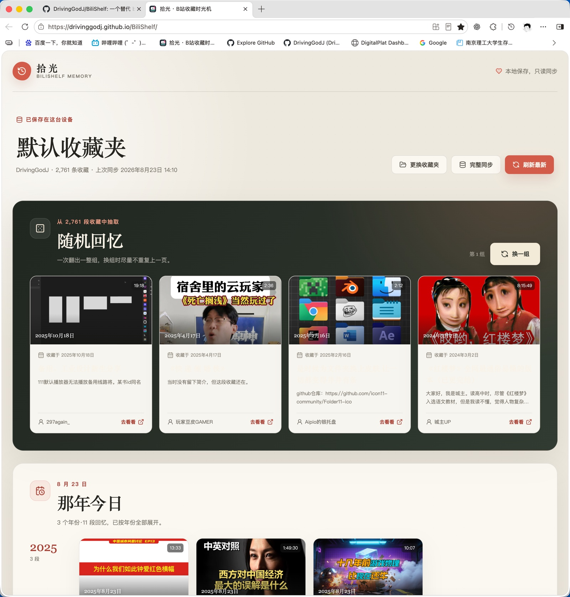
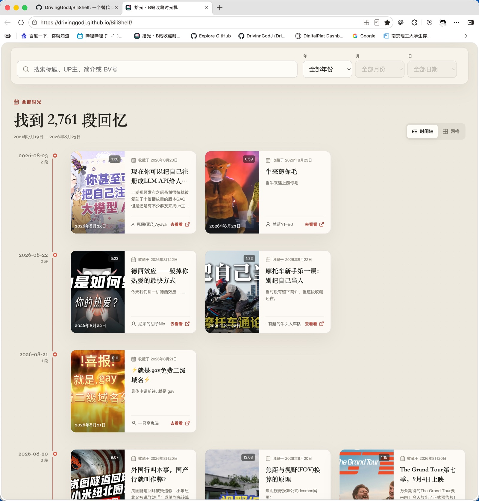

# 拾光 · B站收藏时光机

<p align="center">
  把收藏变成一条可以搜索、回看和偶遇的时间线。
</p>

<p align="center">
  <a href="https://drivinggodj.github.io/shiguang-memory/"><strong>立即打开拾光</strong></a>
</p>

## 这是什么

看到喜欢的视频就放进默认收藏夹，久而久之，收藏夹也变成了一份关于过去的记录。

拾光会读取公开的 B站收藏夹，按照“收藏时间”建立本地索引。你可以直接回到某年、某月、某日，搜索曾经收藏的视频，也可以让“随机回忆”替你打开一段很久没碰过的过去。

它不需要安装扩展，不要求登录 B站，也不会修改你的收藏夹。

## 界面预览

### 随机回忆与那年今日



### 日期检索与时间轴



## 开始使用

1. 打开 [拾光网页版](https://drivinggodj.github.io/shiguang-memory/)。
2. 输入 B站 UID（也支持个人空间链接），点击“查找收藏夹”。
3. 从账号下可公开访问的收藏夹中选择一个导入。也可以展开“链接导入”，粘贴任意公开收藏夹链接（格式：`https://www.bilibili.com/list/ml{收藏夹ID}`）。
4. 等待第一次完整同步，然后按年份、月份或日期开始回看。

收藏夹链接和已经同步的视频会保存在当前浏览器中。下次使用同一个浏览器打开时，会自动回到你的收藏夹。

### 添加到手机主屏幕

- iPhone：使用 Safari 打开网页，点击“分享”→“添加到主屏幕”。
- Android：使用支持安装网页应用的浏览器，选择“添加到主屏幕”或“安装应用”。

主屏幕版本会显示“拾光”图标，并以独立窗口打开。若此前已经保存过没有图标的旧快捷方式，请先删除旧图标，再重新添加。

## 功能

- 按年、月、日筛选收藏时间
- 输入 UID 自动发现并选择收藏夹
- 搜索标题、UP 主、简介和 BV 号
- 时间轴与网格两种浏览方式
- 随机回忆一次展示 4 段视频，可整组更换
- “那年今日”按年份展开往年同日的全部收藏
- 增量刷新会自动识别取消收藏，必要时转为完整核对
- 保留已经同步过的失效视频和移除记录
- 手机与桌面浏览器均可使用
- 自动跟随系统切换深色或浅色外观
- 支持添加到手机主屏幕并显示独立应用图标

## 数据与隐私

拾光采用本地优先设计：

- 收藏夹链接、视频元数据和同步时间保存在浏览器 IndexedDB 中。
- 服务端不建立用户收藏数据库。
- 不接收、不保存也不转发 B站 Cookie。
- 只读取无需登录即可访问的公开收藏夹。
- 不提供新增、移动、删除收藏等写入能力。
- 清除浏览器站点数据会同时清除本地保存的回忆；目前请保留原收藏夹作为数据来源。

## 工作方式

```text
GitHub Pages 网页
  -> https://api.drivinggodj.dpdns.org
  -> Cloudflare 只读同步网关与 Tunnel
  -> Mac 本地只读服务
  -> 查询可访问的收藏夹列表（UID 模式）
  -> B站公开收藏接口
  -> 当前浏览器 IndexedDB
  -> 日期检索、时间轴与随机回忆
```

同步网关只接受固定的只读路由和经过校验的收藏夹参数，并设置缓存、排队和访问频率限制。用户主动刷新时会绕过短期缓存；检测到远端数量变化后，网页会自动核对全部收藏并隐藏已经取消收藏的视频。具体部署可以替换，网页中的个人收藏数据始终以浏览器本地副本为准。

## 关于老收藏日期

B站接口可以返回大部分视频的收藏时间，因此拾光能够查询 2025 年以前的记录。

约 2020 年 7 月以前的部分老收藏可能共享同一个迁移时间。这是 B站现有数据本身的限制，拾光会忠实显示接口返回值，不推测不存在的精确日期。

## 使用限制

- UID 查询只会显示 B站无需登录即可返回的收藏夹；私密收藏夹无法读取。
- 第一次同步大型收藏夹需要逐页读取，请保持页面打开。
- B站接口或同步服务暂时不可用时，新的同步会失败；已经保存到浏览器里的内容仍可继续检索。
- 同一个收藏夹在不同浏览器或设备上的数据相互独立，不会自动跨设备同步。

## 本地开发

需要 Node.js 22+ 和 pnpm。

```bash
pnpm --dir worker install
pnpm --dir frontend install
```

启动本地只读代理：

```bash
pnpm --dir worker start:local
```

另开一个终端启动网页：

```bash
pnpm web:dev
```

访问 `http://localhost:5173`。

检查与构建：

```bash
pnpm --dir worker test
pnpm web:check
pnpm web:build
```

更完整的自托管说明见 [MEMORY_WEB.md](./MEMORY_WEB.md)。部署时不要把账户令牌、Tunnel 凭据、Cookie 或其他密钥提交到仓库。

## 项目结构

```text
frontend/                  拾光网页与本地数据层
worker/                    只读同步网关和本地代理
.github/workflows/         GitHub Pages 自动部署
MEMORY_WEB.md              自托管与维护说明
```

## 开源来源与新增内容

拾光最初从 [TLRKFXE/BiliShelf](https://github.com/TLRKFXE/BiliShelf) 的开源分支发展而来，早期沿用了其 Vue/Vite 工程组织和 B站收藏夹接口适配方式。当前独立仓库只保留拾光网页、数据层与只读代理实现，原扩展和收藏管理中心源码已经移除。

拾光网页版中的收藏日期检索、时间线、随机回忆、那年今日、UID 导入、PWA、本地 IndexedDB 数据结构以及只读数据代理由本项目新增实现。仓库继续遵守 MIT License，并保留原作者版权声明与来源说明。

## 许可

[MIT License](./LICENSE)
